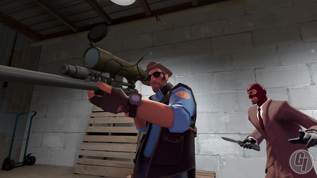
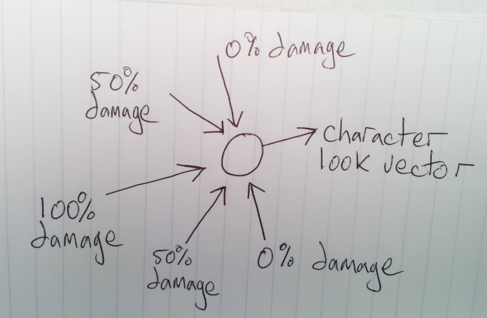

# Game Engines 2 (Game AI) Labs 

## Lab 3
Clone or pull the repo from last week to get the Pursue behaviour. This week I want you to add two additional behaviours, arrive and follow path. 

- Implement the *arrive* behaviour as per the class last week. Check out the notes. You will probably need to implement a decelleration tweaker or play with the slowing distance to make it work properly.
- To implement *follow path*, create a Path class with the following methods:
	- NextWaypoint - Returns the waypoint the boid should be going towards
	- IsLast - Returns a boolean flag to indicate whether the next waypoint is the last waypoint
	- AdvanceToNext - Moves to the next waypoint. If the looped flag is true, then you should go back to the first waypoint when you reach the end, otherwise only go to the next waypoint if you are not already at the end.
	- looped - A boolean flag that indicates whether the path is looped or not
- Give the Boid an instance of a Path and write the follow path behaviour such that:
	- You should seek from waypoint to waypoint, but arrive at the last one
	- Unless the path is looped in which case you should always seek the next waypoint

```
public Vector3 Calculate()
{
    if (calculationMethod == CalculationMethods.WeightedTruncatedRunningSumWithPrioritisation)
    {
        return CalculateWeightedPrioritised();
    }

    return Vector3.zero;
}
```

## Lab 2
In this lab we will be making:
- A forward Euler integrator function
- A seek steering behaviour

To complete the lab:

- Clone the repo: https://github.com/skooter500/BGE4Unity and open the project in Unity3D
- When you run the project you will notice that I have added a FPS camera controller to the camera. This allows you to move the camera around using keyboard and mouse look.
- Take the time to study the code in FPSController to see how it works.
- Create a GameComponent called Boid in the namespace BGE and attach it to the cube. This is kinda fiddley as Unity doesnt really understand namespaces. Figure out how to do this
- Make a public field of type ```Vector3``` called ```seekTarget``` 
- Give it a sensible initiav value in the constructor
- Write a method ```Vector3 Seek(Vector3 target)```. This method should return a force to move the game object towards the target
- Write code in the Update method that integrates the force. It should call Seek to generate the force.
- Create another GameComponent called TargetUpdate and attach it to the camera
- This GameComponent should set the seek target of the Boid script to be a point 20 units in front of the camera.
- Finally! See if you can implement a behaviour that will flee from the player if the distance is < 20

Don't forget and log onto Webcourses and do the MCQ

## Lab 1

This is *Question 1* from the Christmas exam. Attempt to code a solution to this in Unity3D.

Figure 1 shows a screenshot from the computer game Team Fortress 2.


 
Figure 1

- In this game, it is possible for one player to stab another player in the back. Assuming the players encapsulate the member variables given in Figure 2, propose an efficient algorithm for determining if a player is behind another player.

```C++
		glm::vec3 position;
		glm::vec3 look;
```
Figure 2

- In order to stab a player, the stabbing player must be less than a threshold distance stabDistance to the player being stabbed. Write an implementation of the function given in Figure 3. This function should return true if the distance between the stabber and stabbee is < stabDistance.

```C++
bool stab(glm::vec3 stabbee, glm::vec3 stabber, float stabDistance)
```
Figure 3

- The amount of damage inflicted is proportional to the stab angle. Figure 4 illustrates how this is evaluated. Propose an efficient algorithm for how this could be calculated in a game.


 
Figure 4

- Given Figure 2, explain how Team Fortress 2 could implement strafing.

- In Team Fortress 2, players can carry weapons. When the player moves and rotates, the weapon must move and rotate relative to player. Propose a method of implementing this.

- Propose an approach for implementing camera yaw and pitch in Team Fortress 2. In your solution, make use of quaternion rotations.

To do this you should probably:
- Clone this repo: https://github.com/skooter500/BGE4Unity
- This give you a starter Unity 3D project with the code we made in the class last week
- Look up the equivalent of all the GLM functions and classes:
	- Vectors, Quaternions and Matrices
	- Dot and cross product
	- Rotating transforming and scaling
	- How to implement a camera controller (Try and do this from scratch. It will be good for ya!)
	- When you are done, Log on to Webcourses and do the MCQ


